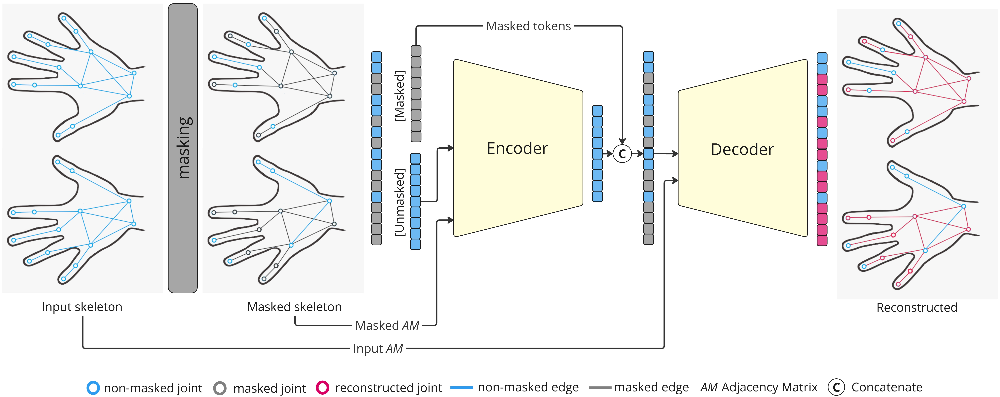

# **Shrec24**
[[SHREC24]](https://www.shrec.net/SHREC-2024-hand-motion/) Skeleton-based Self-Supervised Learning For Dynamic Hand Gesture Recognition

Check out the SHREC24 paper [here](https://www.sciencedirect.com/science/article/pii/S009784932400147X).



## **Updates**
- ...

## **Installation**
Create and activate conda environment:
```
conda create -n shrec24 python=3.10
conda activate shrec24
```

Install all dependencies:
```
pip install -r requirements.txt
```

## Dataset
Download the [**SHREC'24**](https://www.shrec.net/SHREC-2024-hand-motion/) dataset. And set the path to training and test data in the `shrec24_config.yaml` file in the `configs/` folder.

```
 train_data_dir: './path/to/Train-set/'
 test_data_dir: './path/to/Test-set/'
```

### Training

```
bash train.sh --config_file configs/shrec24_config.yaml
```

## Evaluation

```
bash eval.sh --config_file configs/shrec24_config.yaml
```

We thank [MAE](https://github.com/facebookresearch/mae) and [STGCN](https://github.com/yysijie/st-gcn) for making their code available
